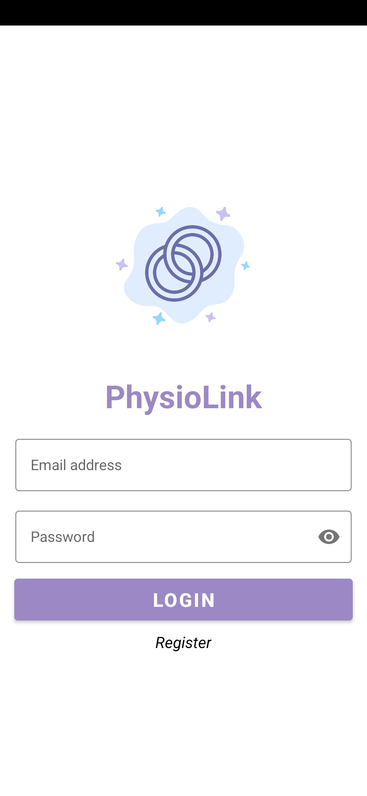
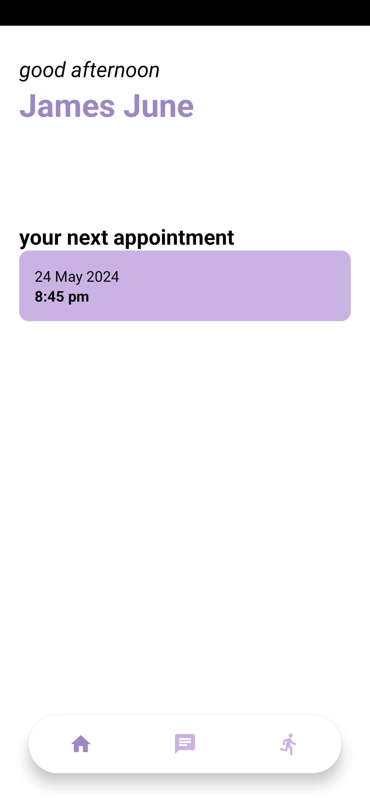
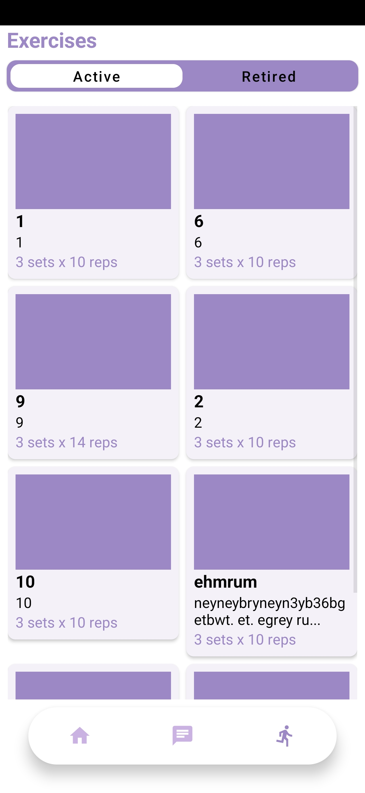
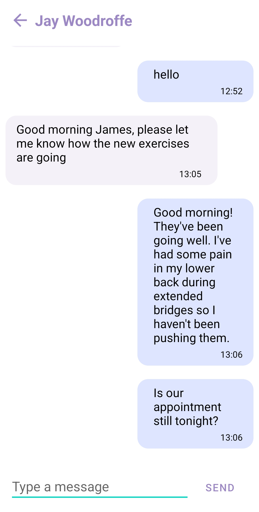

# PhysioLink

PhysioLink is a companion Android application (used in companion to PhysioHub) designed for patients to connect with their physiotherapists, view assigned exercises, manage appointments, and communicate securely. The app aims to streamline the physiotherapy process by providing a structured platform for patient-therapist interactions.

## Table of Contents
- [Features](#features)
- [Technologies Used](#technologies-used)
- [Project Structure](#project-structure)
- [Installation](#installation)
- [Usage](#usage)
- [Screenshots](#screenshots)
- [Documentation](#documentation)
- [License](#license)

## Features

- **Exercise Viewing**: View and track exercises assigned by physiotherapists.
- **Appointment Management**: View upcoming appointments with physiotherapists.
- **Communication**: Secure messaging between patients and their physiotherapists.
- **User Authentication**: Email and password login for patients.

## Technologies Used

- **Front End and Logic**: Android Studio, Kotlin, XML
- **Back End and Data Storage**: Firebase Authentication, Firebase Firestore

## Project Structure

- **Model**: Contains data models (Appointment, ExerciseModel, MessageModel).
- **Data**: Manages data access and operations (AppointmentDataAccess, ChatDataAccess, ExerciseDataAccess).
- **Utils**: Utility classes.
- **Adapter**: Controllers to manage complex activities (ExerciseAdapter, MessageAdapter).
- **Activities**: Handles various activities like logging in, viewing exercises, messaging physiotherapists, and managing appointments.

## Installation

1. Clone the repository: `git clone https://github.com/yourusername/physiolink`
2. Open the project in Android Studio.
3. Set up Firebase in your project by following the [Firebase setup guide](https://firebase.google.com/docs/android/setup).
4. Build and run the app on an Android device or emulator.

## Usage

1. **Sign Up/Login**: Patients can sign up or log in using email and password.
2. **View Exercises**: View and follow the exercises assigned by the physiotherapist.
3. **Manage Appointments**: View upcoming appointments.
4. **Communicate**: Use the in-app messaging feature to communicate with the physiotherapist.

## Screenshots

### Login

### Dashboard

### Exercises

### Chat

## Documentation

For more detailed information, you can refer to the [Project Documentation](./docs/Documentation.md).

